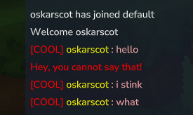

# Hytale Example Plugin

This is an example Hytale plugin, you need to manually include the server jar as a dependency until the maven repo is live.

## Commands

Commands seem to be quite simple following this formar:

```java
public class ExampleCommand extends CommandBase {

  public ExampleCommand() {
    super("test", "Super test command!");
  }

  @Override
  protected void executeSync(@Nonnull CommandContext commandContext) {
    Player player = commandContext.senderAs(Player.class);
    player.getWorld().execute(() -> {
      EventTitleUtil.showEventTitleToPlayer(player.getPlayerRef(), Message.raw("It's modded!"), Message.raw("Yeppers"), true);
    });
  }
}

```

## Events

To register an event you need to use the EventRegistry and use the ```registerGlobal(Class<?> event, Consumer<EventClass> consumer);``` method like this
```java
this.getEventRegistry().registerGlobal(PlayerReadyEvent.class, ExampleEvent::onPlayerReady);
```

```java
public class ExampleEvent {

  public static void onPlayerReady(PlayerReadyEvent event) {
    Player player = event.getPlayer();
    player.sendMessage(Message.raw("Welcome " + player.getDisplayName()));
  }

}

```

## Chat



The chat uses the PlayerChatEvent, it contains the formatter, the PlayerRef for the sender, the content as well as a list of targets (it's safe to assume the targets is the list of players who can see the chat message)
You can cancel this event as well as modify the content and the formatter.

```java
public class ChatFormatter {

  public static void onPlayerChat(PlayerChatEvent event) {
    PlayerRef sender = event.getSender();
    if(event.getContent().equalsIgnoreCase("poo")) {
      event.setCancelled(true);
      sender.sendMessage(Message.raw("Hey, you cannot say that!").color(Color.RED));
    }

    if(event.getContent().equalsIgnoreCase("you stink")) {
      event.setContent("i stink");
    }

    event.setFormatter((playerRed, message) ->
        Message.join(
            Message.raw("[COOL] ").color(Color.RED),
            Message.raw(sender.getUsername()).color(Color.YELLOW),
            Message.raw(" : " + message).color(Color.PINK)
        ));

  }
}
```

The formatter is the following interface:

```java
  public interface Formatter {
    @Nonnull
    Message format(@Nonnull PlayerRef playerRef, @Nonnull String message);
  }
}
```